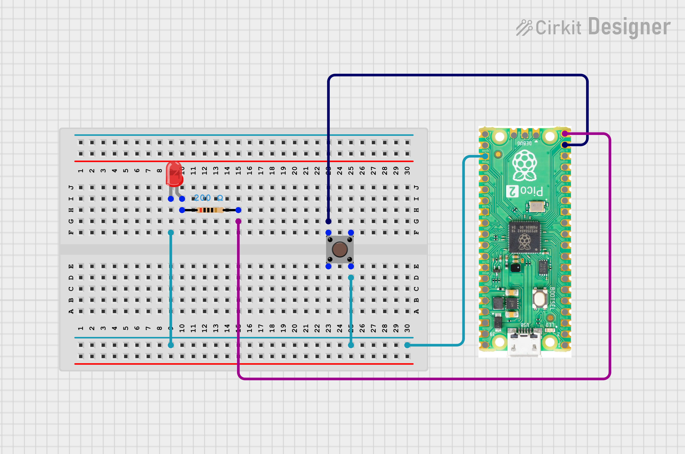

# Day 2: Button Toggle (Push-Pull Input)

Welcome to this project from my **CircuitPython on Pico 2 W** series.  
This project demonstrates reading a digital input with internal pull-up resistor and implementing a clean button toggle pattern.

---

## Project Overview

The goal is to control an LED using a push button in toggle mode — each press flips the LED state. This introduces:

- Reading digital inputs with pull-up configuration
- Debounce logic using a blocking wait loop
- State management with a boolean flag

---

## Hardware Components

- **Board:** Raspberry Pi Pico 2 W
- **Button:** Connected to `board.GP14` (Active LOW with internal pull-up)
- **LED:** Connected to `board.GP15` (External LED)

---

## Wiring


| Component | Pico Pin |
|-----------|----------|
| Button (one leg) | GP14 |
| Button (other leg) | GND |
| LED anode | GP15 |
| LED cathode (via 220 ohm resistor) | GND |

---

## Code (`code.py`)

```python
import board
import digitalio
import time

btn = digitalio.DigitalInOut(board.GP14)
btn.direction = digitalio.Direction.INPUT
btn.pull = digitalio.Pull.UP

led = digitalio.DigitalInOut(board.GP15)
led.direction = digitalio.Direction.OUTPUT

led_state = False
while True:
    if not btn.value:
        led_state = not led_state
        led.value = led_state

    while not btn.value:
        time.sleep(0.01)
    time.sleep(0.001)
```

---

## Key Learnings

### Pull-Up Input Logic
With `Pull.UP`, the pin reads `True` at idle and `False` when the button is pressed (connecting GP14 to GND). So `not btn.value` detects a press.

### Toggle Pattern
A `led_state` boolean tracks the current state. Each button press flips it with `not led_state`, giving persistent toggle behavior rather than momentary control.

### Software Debounce
The inner `while not btn.value` loop blocks until the button is released before the next detection cycle. This prevents multiple rapid toggles from a single physical press.

---

## How to Run

1. Wire the button between GP14 and GND
2. Wire the LED (with series resistor) between GP15 and GND
3. Copy `code.py` to the root of your `CIRCUITPY` drive
4. Open a Serial Monitor (Thonny / Mu Editor)
5. Press the button and observe the LED toggling

---

## 👨‍💻 Author

**Kritish Mohapatra**

Part of the **IoT with CircuitPython Series**