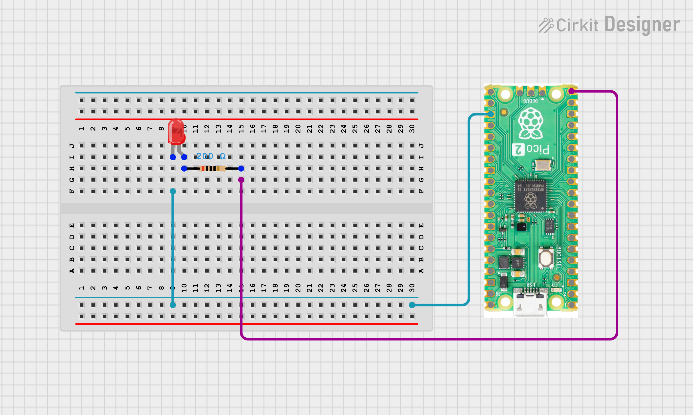

# Day 3: LED Breathing (PWM Fade)

Welcome to this project from my **CircuitPython on Pico 2 W** series.  
This project demonstrates hardware PWM control to create a smooth breathing effect on an LED.

---

## Project Overview

The goal is to fade an LED in and out continuously using PWM (Pulse Width Modulation). This introduces:

- Configuring a PWM output with `pwmio`
- Understanding 16-bit duty cycle range (0 to 65535)
- Creating smooth analog-like effects on a digital pin

---

## Hardware Components

- **Board:** Raspberry Pi Pico 2 W
- **LED:** Connected to `board.GP15` (External LED)

---

## Wiring

| Component | Pico Pin |
|-----------|----------|
| LED anode | GP15 |
| LED cathode (via 220 ohm resistor) | GND |

---

## Code (`code.py`)

```python
import board
import pwmio
import time

led_pwm = pwmio.PWMOut(board.GP15, frequency=500, duty_cycle=0)

while True:
    for i in range(0, 65535, 500):
        led_pwm.duty_cycle = i
        time.sleep(0.01)
    for i in range(65535, 0, -500):
        led_pwm.duty_cycle = i
        time.sleep(0.01)
```

---

## Key Learnings

### PWM in CircuitPython
`pwmio.PWMOut` configures a pin for hardware PWM. The `frequency` parameter (500 Hz here) sets how fast the PWM signal cycles. At 500 Hz the flicker is imperceptible to the human eye.

### 16-bit Duty Cycle
CircuitPython uses a 16-bit duty cycle range: `0` is fully off and `65535` is fully on. This gives 65536 brightness levels for very smooth transitions.

### Breathing Effect
Two `for` loops ramp the duty cycle up from 0 to 65535 and back down in steps of 500. Each step has a 10 ms delay, producing a slow, smooth fade in and out — the classic breathing pattern.

---

## How to Run

1. Wire the LED (with series resistor) between GP15 and GND
2. Copy `code.py` to the root of your `CIRCUITPY` drive
3. Open a Serial Monitor (Thonny / Mu Editor)
4. Observe the LED smoothly fading in and out

---

## 👨‍💻 Author

**Kritish Mohapatra**

Part of the **IoT with CircuitPython Series**