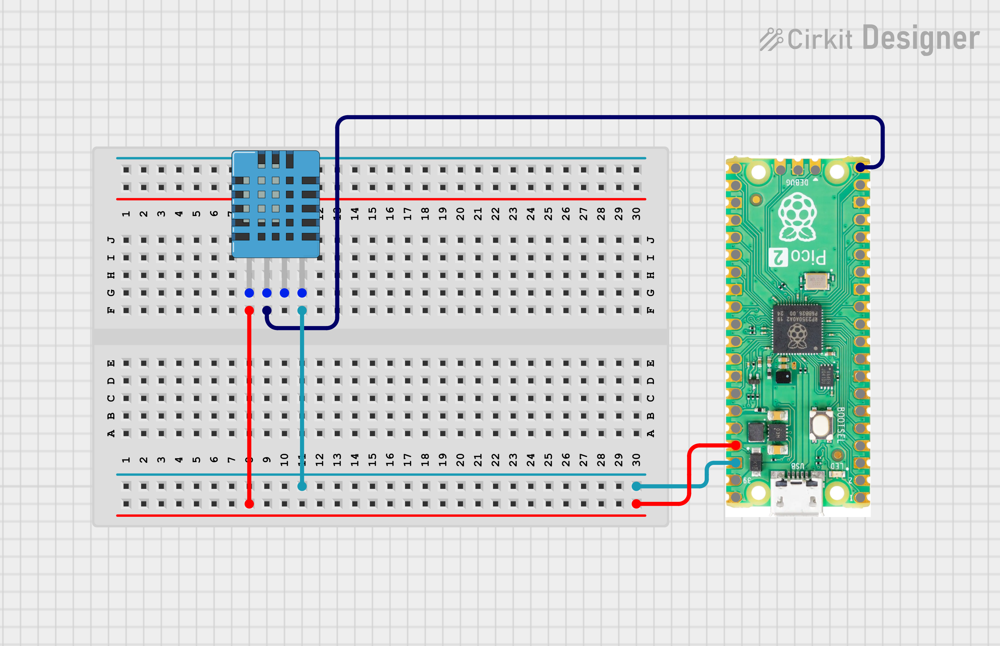

# Day 4: Temperature & Humidity Monitor (DHT11)

Welcome to this project from my **CircuitPython on Pico 2 W** series.  
This project demonstrates reading environmental data from a DHT11 sensor using the Adafruit CircuitPython library.

---

## Project Overview

The goal is to read temperature and humidity from a DHT11 sensor and print the values to the serial console every 2 seconds. This introduces:

- Using a third-party CircuitPython library (`adafruit_dht`)
- Handling sensor read errors gracefully with `try/except`
- Working with single-wire digital sensors

---

## Hardware Components

- **Board:** Raspberry Pi Pico 2 W
- **Sensor:** DHT11 Temperature & Humidity Sensor
- **Connected to:** `board.GP15`

---

## Wiring


| DHT11 Pin | Pico Pin |
|-----------|----------|
| VCC | 3.3V |
| DATA | GP15 |
| GND | GND |

> A 10k ohm pull-up resistor between VCC and DATA is recommended for stable readings.

---

## Library Installation

Install the required library via `circup` or manually copy to `CIRCUITPY/lib/`:

```bash
circup install adafruit_dht
```

Or download `adafruit_dht.mpy` from the [Adafruit CircuitPython Bundle](https://github.com/adafruit/Adafruit_CircuitPython_DHT) and place it in the `lib/` folder on your `CIRCUITPY` drive.

---

## Code (`code.py`)

```python
import board
import adafruit_dht
import time

dht = adafruit_dht.DHT11(board.GP15)

while True:
    try:
        temp = dht.temperature
        hum = dht.humidity
        print(f"Temp is {temp:.1f} C | Humidity: {hum}%")

    except RuntimeError as error:
        print(f"Reading sensor: {error.args[0]}")
        time.sleep(2.0)
        continue
    except Exception as error:
        dht.device.exit()
        raise error
    time.sleep(2.0)
```

---

## Key Learnings

### Adafruit DHT Library
`adafruit_dht.DHT11(pin)` initialises the sensor on the specified GPIO pin. The library handles the single-wire timing protocol internally. For DHT22 (higher accuracy), just swap `DHT11` with `DHT22`.

### RuntimeError Handling
DHT sensors occasionally return a read error due to timing sensitivity on the single-wire bus. Catching `RuntimeError` and continuing the loop prevents a crash and retries after 2 seconds — this is expected behavior, not a wiring fault.

### Clean Device Exit
The outer `except Exception` block calls `dht.device.exit()` before re-raising. This releases the underlying `PulseIn` resource cleanly, preventing hardware lock-up if an unexpected error occurs.

### F-string Formatting
`{temp:.1f}` formats the float to one decimal place, keeping the serial output readable.

---

## Sample Output

```
Temp is 27.0 C | Humidity: 55%
Temp is 27.0 C | Humidity: 55%
Reading sensor: DHT sensor not found, check wiring
Temp is 27.1 C | Humidity: 54%
```

---

## How to Run

1. Wire the DHT11 sensor to GP15, 3.3V, and GND
2. Install the `adafruit_dht` library into `CIRCUITPY/lib/`
3. Copy `code.py` to the root of your `CIRCUITPY` drive
4. Open a Serial Monitor (Thonny / Mu Editor)
5. Observe temperature and humidity readings every 2 seconds

---

## 👨‍💻 Author

**Kritish Mohapatra**

Part of the **IoT with CircuitPython Series**