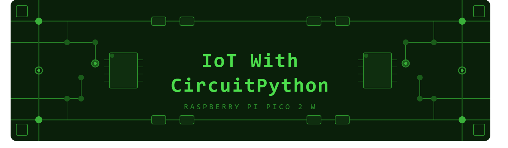

#  IoT With CircuitPython

A collection of hands-on IoT projects built with **CircuitPython** on the **Raspberry Pi Pico 2 W** — exploring sensors, displays, wireless communication, and more.

> Projects are added gradually. No fixed schedule — just consistent learning. 🚀

---

---

##  Hardware Used

- Raspberry Pi Pico 2 W (primary board)
- Various sensors, displays, and modules (listed per project)

##  Software

- [CircuitPython](https://circuitpython.org/)
- [Adafruit CircuitPython Bundle](https://github.com/adafruit/Adafruit_CircuitPython_Bundle)
- [Mu Editor](https://codewith.mu/) / Thonny / VS Code

---

##  Projects

| # | Project | Category | Status |
|---|---------|----------|--------|
| 01 | [Blink — Onboard LED](Project_1\README.md) | GPIO | ✅ |
| 02 | External LED + Button | GPIO | 🔜 |
| 03 | PWM LED Breathing | GPIO | 🔜 |
| 04 | DHT11 Temperature & Humidity | Sensors | 🔜 |
| 05 | BMP280 Pressure Sensor | Sensors | 🔜 |
| 06 | Ultrasonic Distance Sensor | Sensors | 🔜 |
| 07 | LDR Light Sensor | Sensors | 🔜 |
| 08 | PIR Motion Detector | Sensors | 🔜 |
| 09 | SSD1306 OLED Hello World | Display | 🔜 |
| 10 | OLED Sensor Dashboard | Display | 🔜 |
| 11 | ST7735 TFT Display | Display | 🔜 |
| 12 | TFT Animated Graphics | Display | 🔜 |
| 13 | Wi-Fi Connect + IP Display | Wi-Fi | 🔜 |
| 14 | HTTP GET — Fetch Weather API | Wi-Fi | 🔜 |
| 15 | HTTP POST — ThingSpeak | Wi-Fi | 🔜 |
| 16 | MQTT — Adafruit IO | MQTT | 🔜 |
| 17 | MQTT — Node-RED Dashboard | MQTT | 🔜 |
| 18 | BLE Advertise | BLE | 🔜 |
| 19 | BLE LED Control from Phone | BLE | 🔜 |
| 20 | BLE Sensor Data Stream | BLE | 🔜 |
| 21 | Servo Motor Control | Motors | 🔜 |
| 22 | DC Motor with L298N | Motors | 🔜 |
| 23 | Stepper Motor | Motors | 🔜 |
| 24 | Mini Weather Station | Mini Project | 🔜 |
| 25 | IoT Relay Control via MQTT | Mini Project | 🔜 |

---

##  Getting Started

1. Download CircuitPython for Pico 2 W from [circuitpython.org](https://circuitpython.org/board/raspberry_pi_pico2_w)
2. Hold BOOTSEL and plug in USB — drag `.uf2` to `RP2350` drive
3. Board remounts as `CIRCUITPY`
4. Copy `code.py` from any project folder to `CIRCUITPY`
5. Done — it runs automatically!

---

##  Author

**Kritish Mohapatra**  
B.Tech Electrical Engineering, OUTR Bhubaneswar  
[GitHub](https://github.com/kritishmohapatra) • [Twitter/X](https://x.com/OD_KR)

> Also check out my [#100DaysOfIoT](https://github.com/kritishmohapatra/100_Days_100_IoT_Projects) challenge — 100 MicroPython IoT projects!

---
